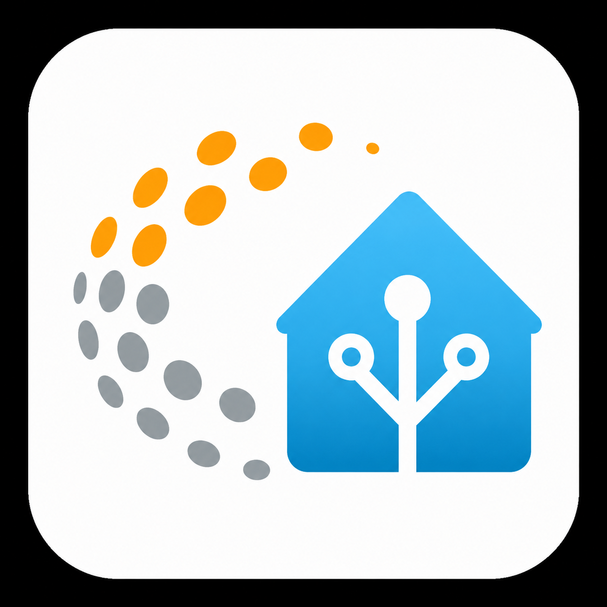

# Larnitech HA Bridge

Local-first Home Assistant integration for Larnitech-compatible smart home systems.

The integration connects to a local Larnitech API2 WebSocket controller and exposes supported Larnitech items as native Home Assistant entities.

## Highlights

- Local API2 WebSocket connection.
- Native Home Assistant config flow.
- Lights and dimmers.
- Common sensors and binary sensors.
- Valves as switch entities.
- Fan-coils as simple ON/OFF fan entities.
- Room/area-based device grouping when Larnitech area metadata is available.
- Clean entity naming: low-level prefixes such as `Setup` are removed from user-facing names.
- Optional area overrides for Setup items that should appear in real rooms.
- Setup/unassigned items are exposed under a dedicated `Setup` area device.
- Dedicated `Light groups` section for Larnitech light schemes and virtual grouped lights.
- Generic low-level items without meaningful names are hidden by default.

## Notes

This integration runs locally and does not require a license key.

Fan-coil speed and heat/cool mode control are intentionally not exposed in the public baseline.
